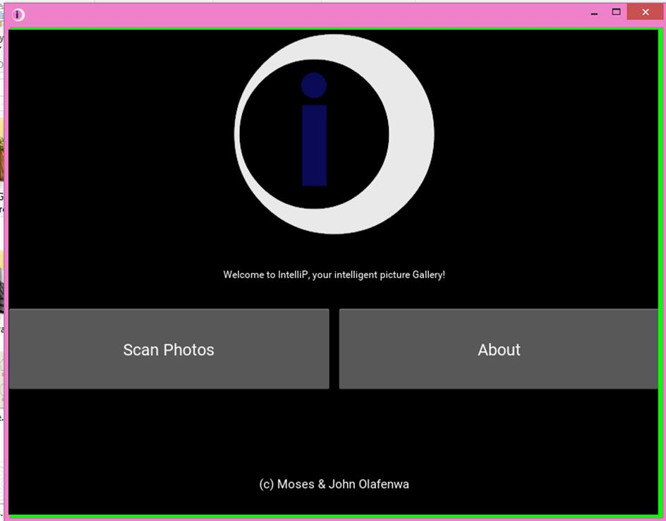
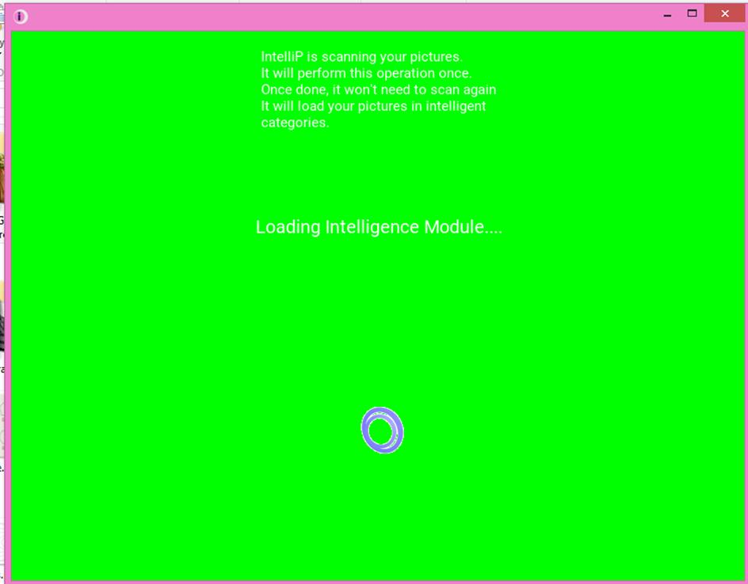
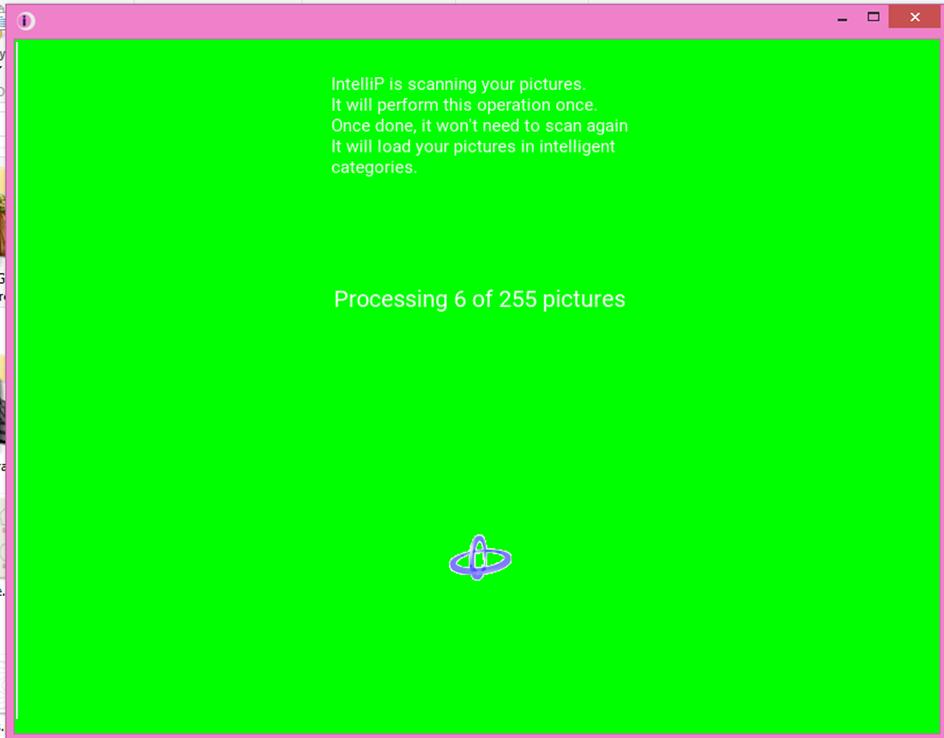
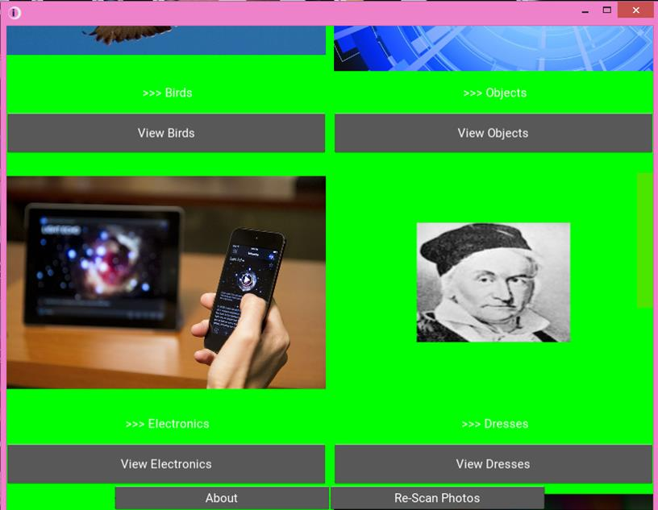
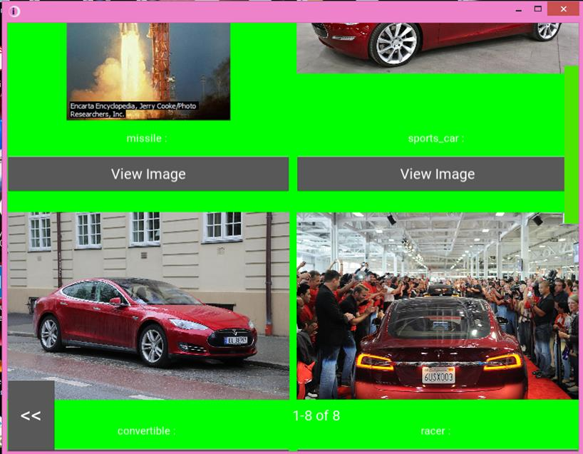
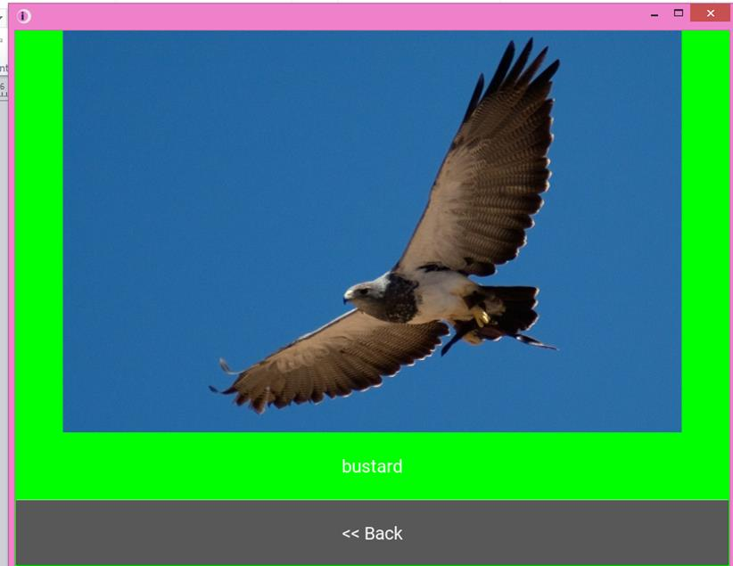

# IntelliP
IntelliP (Intelligent Photos) is a Windows photo gallery that intelligently organizes the  pictures in your computer into 12 unique and related categories.

<h1><b>IntelliP</b></h1>

  
        It works by scanning through
        the pictures in your Windows download folder, documents folder, desktop folder, videos folder, pictures
         folder and it's subfolders. It obtains the pictures and run a self-contained <b>Intelligence Module</b> prediction
          on each picture and store the pictures in their respective categories. The <b>Intelligence Module</b>
           is made possible by the <b><a href="" style="text-decoration: none;" >ImageAI</a></b> library
        , that enables applications and systems built with Python to have self-contained image prediction
         capabilities.    You can download the IntelliP Windows installer via this <b><a href="">link</a></b>.   
     
    
    
     
    
     
<h3><b>Dependencies</b></h3>

IntelliP was built using Python 3.5, Kivy (Python UI framework) and <b><a href="" style="text-decoration: none;" >ImageAI</a></b>. The ResNet model is the computer vision model used to power the image prediction.  The entire source code and resources used in building the <b>IntelliP</b> application is included in  this repository. The source code have the following dependencies:  
 <b>- Python 3.5  </b>   
          <b>- Tensorflow 1.4.0 </b> 
          <b>- Numpy 1.14.2 </b>   
          <b>- SciPy 1.0.0 </b>  
          <b>- ImageAI 1.0.1 </b>  
          <b>- Kivy 1.10.0 </b>  
          <b>- Kivy Glew 0.1.9 </b>  
          <b>- Kivy SDL2 0.1.17 </b>     In addition to the files contained in this repository, follow this <a href="">link</a> to 
download the ResNet model used in the Intelligence Module.    
<h3><b>Contact Developers</b></h3>

This application was built to demonstrate the potentials contained in the <b><a href="" style="text-decoration: none;" >ImageAI</a></b>
 python library for application and systems developements. You can reach to us via our contacts below:
   
  <b>Moses Olafenwa</b>  
 <i>Website: </i>  <a style="text-decoration: none;" href="https://moses.specpal.science"> https://moses.specpal.science</a>  
 <i>Twitter: </i>    <a style="text-decoration: none;" href="https://twitter.com/OlafenwaMoses"> @OlafenwaMoses</a>  
      <i>Medium : </i>    <a style="text-decoration: none;" href="https://medium.com/@guymodscientist"> @guymodscientist</a>  
      <i>Facebook : </i>    <a style="text-decoration: none;" href="https://facebook.com/moses.olafenwa"> moses.olafenwa</a>  
  
      <b>John Olafenwa</b>  
      <i>Website: </i>    <a style="text-decoration: none;" href="https://john.specpal.science"> https://john.specpal.science</a>  
      <i>Twitter: </i>    <a style="text-decoration: none;" href="https://twitter.com/johnolafenwa"> @johnolafenwa</a>  
      <i>Medium : </i>    <a style="text-decoration: none;" href="https://medium.com/@johnolafenwa"> @johnolafenwa</a>  
      <i>Facebook : </i>    <a style="text-decoration: none;" href="https://facebook.com/olafenwajohn"> olafenwajohn</a>  

